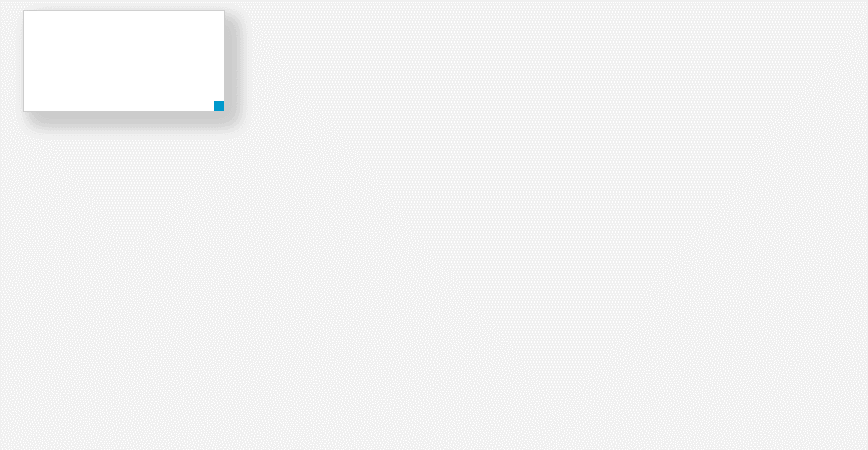

# jQuery实现元素拖拽缩放关闭功能jqueryDrage

效果如下：


fdsfdsfd
核心代码：
```
    $(document).mousemove(function(e) {
        if (!!this.move) {
            var posix = !document.move_target ? {'x': 0, 'y': 0} : document.move_target.posix,
                callback = document.call_down || function() {
                        $(this.move_target).css({
                            'top': e.pageY - posix.y,
                            'left': e.pageX - posix.x
                        });
                    };

            callback.call(this, e, posix);
        }
    }).mouseup(function(e) {
        if (!!this.move) {
            var callback = document.call_up || function(){};
            callback.call(this, e);
            $.extend(this, {
                'move': false,
                'move_target': null,
                'call_down': false,
                'call_up': false
            });
        }
    });
```

demo code:
```
    $('.box').mousedown(function(e) {
        var offset = $(this).offset();
        this.posix = {'x': e.pageX - offset.left, 'y': e.pageY - offset.top};
        $.extend(document, {'move': true, 'move_target': this});
    }).on("click",".closeBox",function(){
        $(this).parent().hide();
    }).on('mousedown', '.coor', function(e) {
        var _t = $(this).parent();
        var posix = {
            'w': _t.width(),
            'h': _t.height(),
            'x': e.pageX,
            'y': e.pageY
        };
        $.extend(document, {'move': true, 'call_down': function(e) {
            _t.css({
                'width': Math.max(30, e.pageX - posix.x + posix.w),
                'height': Math.max(30, e.pageY - posix.y + posix.h)
            });
        }});
        return false;
    });
```

